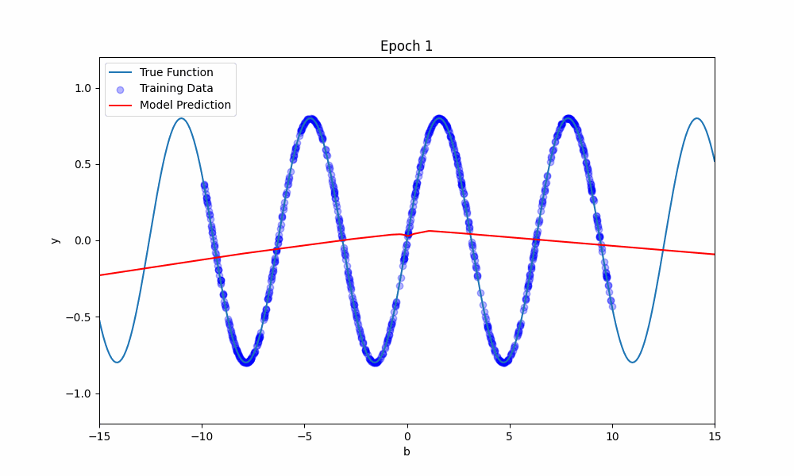

# Sine Model Analysis

This repository contains the code and analysis for predicting a sine function using a neural network. The experiments focus on understanding the effect of neural network depth and width on model performance, when the total number of trainable parameters is kept approximately constant. The experiments further explores the performance of the neural network both within the training range and outside of it.

## Objective
- **Within the Training Range:** Where the NN is trained with data sampled from a specific range (e.g., [-10, 10]).
- **Outside the Training Range:** Where the NN is tested on extrapolated data outside this range (e.g., [-15, -10) ∪ (10, 15]).

## Key Steps

1. **Data Generation**:
   - We generate a dataset of `num_samples` random values from a uniform distribution within a specified `test_range` (e.g., [-10, 10]).
   - The target values are computed as \(y = \sin(b)\).

2. **Model Configuration**:
   - We explore different depths (number of layers) and widths (number of neurons per layer) of the NN. The total number of trainable parameters is kept roughly constant across these configurations to ensure a fair comparison.
   - The depth is varied from 1 to 10 layers, and the width is adjusted accordingly.

3. **Training and Evaluation**:
   - For each depth, the NN is trained multiple times (defined by `runtimes`) to account for variability in the training process.
   - The performance is evaluated using Mean Squared Error (MSE) both on the test set within the training range and on the test set outside the training range.

4. **Averaging Results**:
   - The MSE results for each depth are averaged across all runs to obtain a more stable estimate of the network’s performance.

5. **Visualization**:
   - The MSE results are plotted to compare the NN’s performance as a function of its depth.
   - Separate plots are generated for the performance within the training range and outside the training range.

## Google Colab Notebooks
- [Sine Function Model Analysis](sine_model_analysis.ipynb): This notebook contains the code for generating data, building and training the model, and evaluating the model's performance.

## Overview
The first part of the analysis explores how the neural network's performance changes as a function of depth and width, while keeping the total number of trainable parameters roughly constant.

The second part of the analysis demonstrates how the model's predictions evolve during training using a GIF that visualizes the model's predictions over time.

