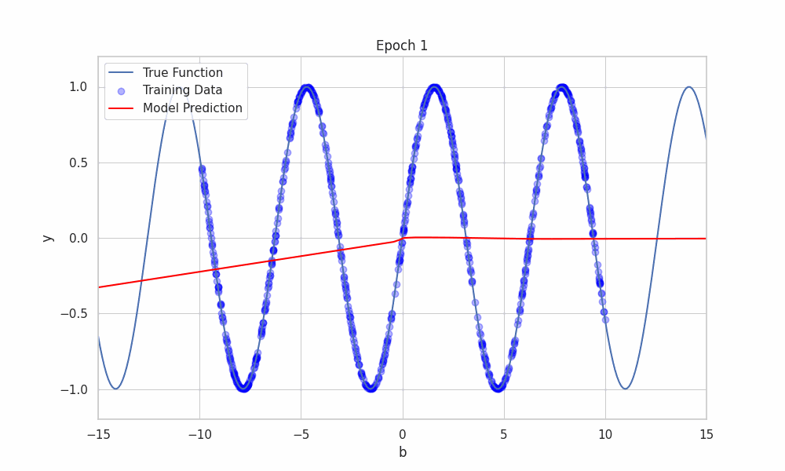

# Sine Model Analysis

This repository contains the code and analysis for predicting a sine function using a simple neural network. The experiments focus on understanding the effect of neural network depth and width on model performance, when the total number of trainable parameters is kept approximately constant. The experiments further explores the performance of the neural network both within the training range and outside of it.

## Background: Neural Networks and Function Approximation

Neural networks are powerful tools for approximating complex functions. One of the fundamental questions in neural network theory is how well these models can approximate known functions, such as the sine function. This question is closely related to the **Universal Approximation Theorem**, which has profound implications for understanding the potential of neural networks.

### Universal Approximation Theorem

The **Universal Approximation Theorem** states that a feedforward neural network with just **one hidden layer** (also known as a **shallow** network) can approximate any **continuous function** on a closed interval to arbitrary precision, provided it has enough neurons in the hidden layer. This means that, in theory, even a simple neural network can represent very complex functions.

However, there are important caveats to this result:
- **Number of Neurons**: The theorem does not specify how many neurons are required to achieve a given level of precision. In practice, the number of neurons needed to approximate a complex function like sine may be very large.
- **Training with Backpropagation**: While the theorem guarantees the *existence* of a neural network that can approximate a function, it does not ensure that gradient-based methods such as **backpropagation** will successfully find this approximation during training. This is because the training process is subject to issues like local minima, vanishing gradients, and overfitting, which can affect the model's ability to learn the optimal approximation.
- **Trade-offs between Depth and Width**: Although a shallow network can approximate any continuous function, deeper networks (with more hidden layers) can often achieve the same approximation with fewer neurons per layer. In recent years, **deep networks** have become more popular because they tend to generalize better and are more efficient in practice.

### Implications for Function Approximation

In this project, we explore how neural networks can approximate the sine function, which is a fundamental and continuous function. We investigate the following:
- How well a neural network with different depths and widths can approximate the sine function both **within** and **outside** the training range.
- The effect of keeping the **total number of trainable parameters constant** while varying the depth and width. This helps us understand how neural networks balance complexity and capacity when approximating functions.

Although the Universal Approximation Theorem suggests that a shallow network could approximate the sine function given enough neurons, in practice:
- **Deep networks** (with more hidden layers) may provide better generalization and faster convergence when using gradient-based training methods like backpropagation.
- **Shallow networks** may require an impractically large number of neurons to approximate the sine function with high precision.

In this analysis, we aim to observe these trade-offs and gain insight into the practical challenges of function approximation using neural networks.

## Key Steps

1. **Data Generation**:
   - We generate a dataset of `num_samples` random values from a uniform distribution within a specified `test_range` (e.g., [-10, 10]).
   - The target values are computed as $y = \sin(b)$.

2. **Model Configuration**:
   - We explore different depths (number of layers) and widths (number of neurons per layer) of the NN. The total number of trainable parameters is kept roughly constant across these configurations to ensure a fair comparison.
   - The depth is varied from 1 to 10 layers, and the width is adjusted accordingly.

3. **Training and Evaluation**:
   - For each depth, the NN is trained multiple times (defined by `runtimes`) to account for variability in the training process.
   - The performance is evaluated using Mean Squared Error (MSE) both on the test set within the training range (e.g., [-10, 10]) and on the test set outside the training range (e.g., [-15, -10) ∪ (10, 15]).

4. **Averaging Results**:
   - The MSE results for each depth are averaged across all runs to obtain a more stable estimate of the network’s performance.

5. **Visualization**:
   - The MSE results are plotted to compare the NN’s performance as a function of its depth.
   - Separate plots are generated for the performance within the training range and outside the training range.

## Understanding Trainable Weights and Scaling

### Trainable Weights in a Neural Network

The number of trainable weights in a neural network depends on the architecture's width (number of neurons per layer) and depth (number of hidden layers).

For a neural network with:
- **Depth $d$**: Number of hidden layers.
- **Width $n$**: Number of neurons in each hidden layer.

The total number of trainable parameters $P$ (including weights and biases) is given by:

$$
P = (d-1) \times n^2 + (d+2) \times n + 1
$$

This formula accounts for:
1. **Weights between the Input Layer and the First Hidden Layer**: $1 \times n$.
2. **Weights between Hidden Layers**: $(d-1) \times (n \times n)$.
3. **Weights between the Last Hidden Layer and the Output Layer**: $n \times 1$.
4. **Biases**: Each hidden layer contributes $n$ biases, and the output layer contributes 1 bias.

### Case for a Single Hidden Layer ($d = 1$)

When the network has a single hidden layer ($d = 1$):
- The total number of trainable parameters simplifies to:

$$
P = 3n + 1
$$

### Scaling the Width as a Function of Depth

To keep the total number of trainable parameters roughly constant while increasing the depth of the network, the width of each layer needs to be adjusted. If we start with 1 hidden layer of 100 neurons, the total number of parameters is 301.

When adding more layers (increasing depth):
- The width of each layer must decrease to maintain the same total number of parameters.
- The width $n$ for a network with depth $d$ (number of hidden layers) can be approximated as:

$$n \approx \sqrt{\frac{\text{total parameters}}{(d - 1)}}$$

For example, if we increase the depth from 1 to 2 layers while keeping the total parameters constant at 301:
- The width for 2 hidden layers would be:

$$n \approx \sqrt{\frac{301}{2 - 1}} = \sqrt{301} \approx 17$$

As the depth increases, the width $n$ continues to decrease according to this relationship.

## Google Colab Notebook
The first part explores how the neural network's performance changes as a function of depth and width, while keeping the total number of trainable parameters roughly constant.

The second part of the analysis demonstrates how the model's predictions evolve during training using a GIF that visualizes the model's predictions over time.

